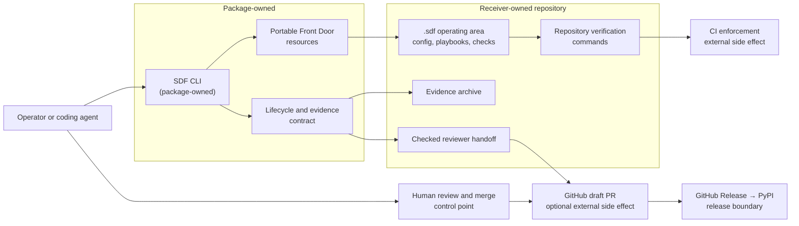
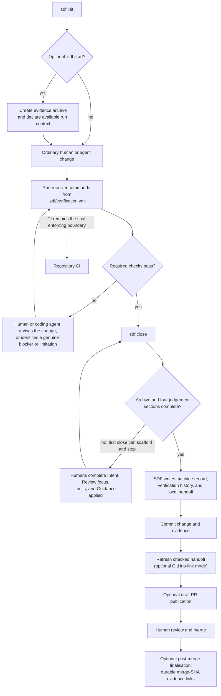

# Architecture

## System overview

Software Dark Factory (SDF) is a local Python CLI and a repository-installed
operating layer for governed AI-assisted delivery. The package supplies a
portable Front Door; the receiver repository supplies its own standards,
checks, playbooks, and evidence.

Your team defines what acceptable delivery means. SDF makes those standards,
checks, and evidence executable before human review. It records what ran and
what was recorded; it does not prove that a change is correct.

SDF is not an autonomous approval or merge system, repair or deployment tool,
universal standards library, or hosted scanning requirement. Local
verification and human review remain central to the model.

## Ownership model

SDF separates portable mechanics from repository policy. The package owns the
CLI implementation, portable Front Door resources, lifecycle and evidence
contract implementation, and packaging/release identity. A receiver owns its
application code and, after installation, its `.sdf` operating area:

| Package-owned | Receiver-owned after installation |
| --- | --- |
| CLI commands and dispatch | `.sdf/config.yml` and `.sdf/verification.yml` |
| Portable Front Door resources | Repository-specific playbooks and guidance |
| Lifecycle and evidence contract | Engineering standards and verification commands |
| Packaging and release identity | Evidence archives, review, and merge decisions |

`sdf init` is deliberately non-destructive. It creates missing Front Door
files, leaves existing receiver files in place, and may append a missing
managed rule to `.gitignore` or `.gitattributes`. It reports drift instead of
repairing receiver-owned material automatically. The declarative
[receiver payload manifest](src/sdf_cli/receiver_payload_manifest.py) is the
shared contract for that behaviour.

## Governed change lifecycle

Required verification failures return work to the delivery loop: a human engineer or coding agent operating under repository guidance may revise the implementation and rerun the checks, or surface a genuine unresolved blocker or limitation honestly. SDF does not repair the change itself; it preserves verification history, including whether a final passing run followed earlier failures. Required failures block a passing closeout, while optional checks stay reviewer-visible but non-blocking; CI remains the final enforcing boundary and human review remains the merge decision.

`sdf start` is useful but not mandatory. A close-first workflow can run the
configured verification and scaffold missing evidence, then stop until a human
completes the judgement sections; a second close completes the record. SDF owns
the machine record, while humans own the judgement sections. Neither a passing
closeout nor CI makes a merge decision.

## Command and module families

The implementation uses small modules to keep edits bounded and testable. The
architectural unit is a cohesive family, not an assertion that the current flat
namespace is permanently ideal.

| Family | Responsibility | Primary interface or command | Main side effect |
| --- | --- | --- | --- |
| CLI and dispatch | Parse requests and keep printing at the edge | `sdf` / `main.py` | Terminal output |
| Receiver installation and inspection | Install and report the portable Front Door | `sdf init`, `status`, `guidance` | Receiver files and shared Git rules |
| Guidance and verification configuration | Route local guidance and parse supported check schema | `.sdf/config.yml`, `.sdf/verification.yml` | Reads receiver policy |
| Verification execution | Run configured full or focused checks and collect facts | `sdf verify` | Repository shell commands |
| Evidence and closeout | Scaffold, validate, update, and close an archive | `sdf start`, `sdf close` | Atomic evidence updates |
| Reviewer handoff and link policy | Render and check review material and evidence links | `sdf close --refresh-handoff` | Local handoff artifact |
| GitHub publication and finalisation | Publish an eligible PR body and rewrite landed links | CI-only commands/workflows | GitHub API PR-body mutation |
| Packaging and release | Build, verify, and publish distributions | [`release.yml`](.github/workflows/release.yml) | GitHub Release and PyPI publication |

## Evidence contract

Each `change-id` has one evidence archive, centered on `evidence.md`. The
reviewer-facing document contains four human-authored judgement sections:
Intent, Review focus, Limits, and Guidance applied. Its `## Machine Record` is
tool-owned and canonical; it holds repository and run context, closeout state,
and verification history and timings.

Machine-record updates use an atomic replacement, preserve the human narrative,
and reject non-canonical parse/render changes. This makes the human and machine
ownership boundary explicit rather than treating the document as a free-form
log. See the current merged
[architecture-cleanup evidence archive](https://github.com/johnnybutler7/sdf-cli/blob/9df837c76acec1806d1122915be6557f2771f24d/.sdf/evidence/pre-release-architectural-sediment/evidence.md)
for a complete example.

The record reports what ran and what was recorded. It does not prove
correctness, and evidence is review material rather than an automatic approval
mechanism. In publication mode, handoff links use immutable full SHAs; after a
merge, eligible evidence links can be rewritten to the durable merge SHA.

## Verification boundary

The receiver owns `.sdf/verification.yml`. SDF executes its configured commands
through the shell because they are receiver-controlled code with the same trust
class as repository CI, a Makefile, or another local build script. Inspect
those commands before running them.

Required failures block a passing closeout. Optional checks remain visible but
do not block it. Focused verification provides narrower feedback while working;
it is not a substitute for a full closeout. SDF captures results and timings but
does not infer correctness from them.

The configuration parser is intentionally a limited YAML-like parser for the
supported command schema. It supports ordinary scalar comments, keeps command
strings literal, and avoids a PyYAML runtime dependency. That boundary should
be revisited if the supported schema needs to become substantially richer.

### Side-effect seams

Meaningful external seams have production adapters and test substitutes:
filesystem writes, repository shell commands, Git subprocess access, GitHub
CLI/API access, clocks, and stdout/stderr. Representative paths are
[verification command execution](src/sdf_cli/verification_command_execution.py),
[the GitHub publication boundary](src/sdf_cli/open_pr_github.py), and
[receiver scaffolding](src/sdf_cli/receiver_scaffold.py). The
[workflow-injection regression test](tests/test_publish_open_pr_body_workflow.py)
exercises hostile dispatch input without allowing it to become shell syntax.

## GitHub publication

GitHub publication is optional. A passing closeout produces a checked local
handoff; the manual publication workflow reads committed evidence through the
GitHub API and does not execute PR-head code. Before it can mutate a body, SDF
checks the PR number, open-draft state, same-repository head, trusted base
branch, evidence identity, and generated handoff.

The mutation is narrowly limited to the PR body. An ETag freshness check helps
avoid overwriting a body that changed after observation; it is a guard, not a
claim that every race is eliminated. The post-merge finalizer retains other PR
content and rewrites eligible evidence links to the merge SHA.

Inspect the [eligibility policy](src/sdf_cli/open_pr_publication_readiness.py),
[GitHub adapter](src/sdf_cli/open_pr_github.py),
[hostile-input workflow test](tests/test_publish_open_pr_body_workflow.py), and
[finalized merged PR #4](https://github.com/johnnybutler7/sdf-cli/pull/4).

## Release engineering

A published GitHub Release triggers the
[release workflow](.github/workflows/release.yml); it does not mean `0.1.0`
has already been published. The workflow verifies the tag matches the package
version, builds exactly the intended wheel and source distribution, installs
each artifact in a fresh environment, and exercises its installed CLI and
receiver initialization.

Only the verified distribution artifacts move to the publish job. That job
alone receives `id-token: write`; PyPI Trusted Publishing is gated by the
`pypi` environment and its human approval. All GitHub Actions are pinned to
immutable SHAs.

## Why this architecture

| Decision | Benefit and trade-off |
| --- | --- |
| Receiver ownership | Teams keep control of acceptable delivery; SDF supplies execution and evidence, not universal policy. |
| Zero runtime dependencies | Isolated installation has less resolver and supply-chain friction. The cost is narrow custom parsers and more project-owned code; richer schemas should prompt reconsideration. |
| Explicit trust boundaries | Receiver verification is trusted local code. Untrusted GitHub inputs are validated and bounded before use and never passed to a shell. |
| Small bounded modules | Smaller slices support reviewable edits, focused tests, and visible side effects. Too much splitting harms locality, so cohesive future grouping remains an option. |
| Evidence before review, humans at merge | SDF prepares acceptance context, checks, history, risks, and limits; reviewers still judge the code and decide whether to merge. |

## Developer Preview boundaries

- Python 3.11–3.14 and Linux/macOS-style POSIX environments are currently
  supported and tested; Windows is not currently claimed.
- GitHub-specific publication automation is optional.
- Receiver Front Doors have no automatic upgrade migration yet.
- Verification has no timeout or output-streaming guarantee.
- External multi-team adoption is not yet claimed.

## Glossary

**Front Door** — The portable starting guidance and contracts that `sdf init`
installs into a receiver repository.

**Receiver** — A repository that installs SDF and defines its own delivery
standards, checks, and review decisions.

**`.sdf` operating area** — Receiver-owned configuration, playbooks, contracts,
and evidence under the repository's `.sdf` directory.

**Governed change** — A normal repository change accompanied by configured
verification and concise reviewer evidence.

**Change-id** — The stable identifier for one evidence archive.

**Evidence archive** — The per-change directory at `.sdf/evidence/<change-id>`
that contains the review record.

**Machine record** — The canonical, tool-owned YAML record embedded in
`evidence.md`.

**Judgement sections** — The four human-authored sections: Intent, Review
focus, Limits, and Guidance applied.

**Verification boundary** — The receiver-configured full set of commands that
SDF runs for closeout.

**Focused verification** — A selected subset of configured checks for feedback
while working; it does not replace full closeout.

**Closeout** — The full verification, evidence recording, and local handoff
step performed by `sdf close`.

**Checked handoff** — Generated local reviewer material validated against the
recorded evidence and link policy.

**Publication-ready** — A checked GitHub-link handoff whose evidence is
committed at the referenced current HEAD.

**Finalisation** — The optional post-merge rewrite of eligible evidence links
to the durable merge SHA.

**Declared run context** — Available, explicitly recorded information about the
surface, model, reasoning, and speed used for a change; unknown is retained
rather than inferred.
